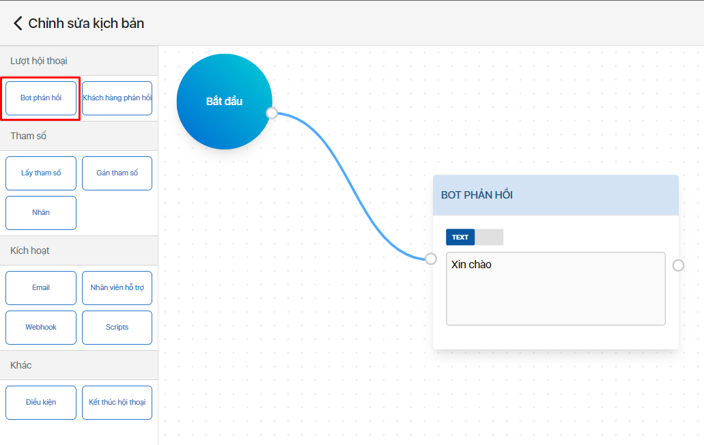
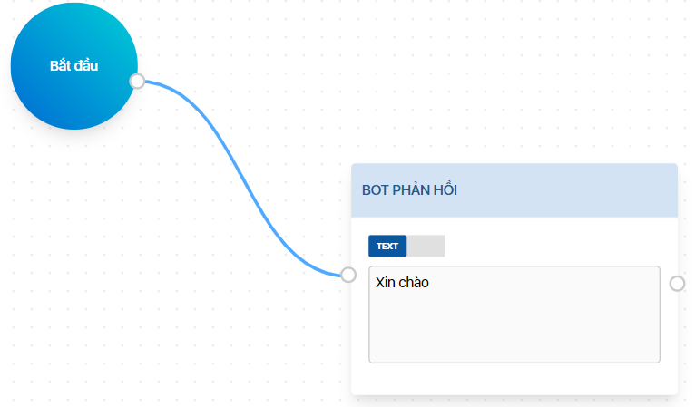
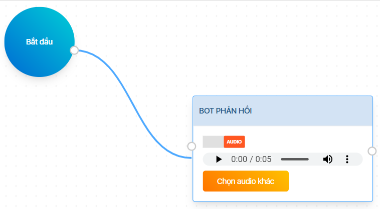
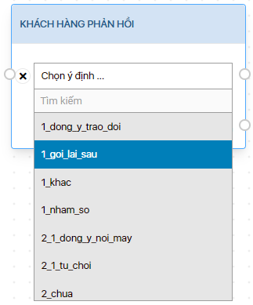
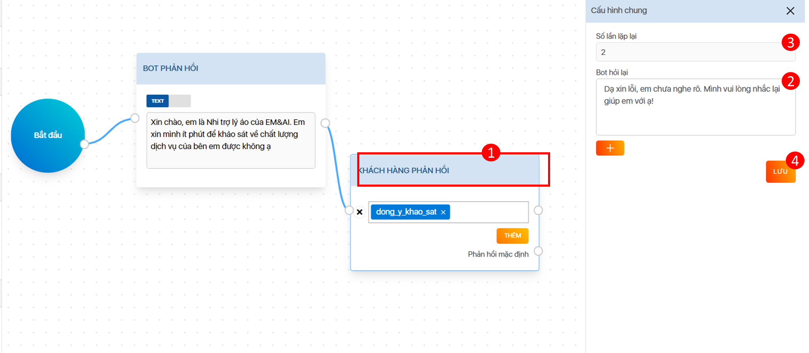
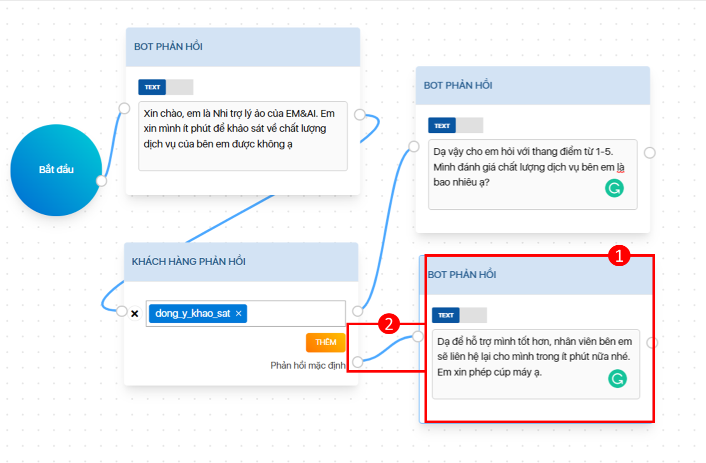

# Lượt hội thoại

## Bot phản hồi (Bot says) 

Sử dụng khối này để thêm phản hồi AI BOT vào luồng hội thoại.

_**Cách thiết lập**_

(1) Kéo thả khối Bot phản hồi vào Canvas

(2) Có thể thêm phản hồi AI BOT theo 2 dạng:

* Text: AI BOT sẽ phản hồi theo nội dung được soạn sẵn

* Audio: AI BOT sẽ phản hồi bằng cách phát ra Audio đã tải lên

## &#x20;

## Khách hàng phản hồi (User says) 

Sử dụng khối này để thêm phản hồi của USER trong luồng hội thoại.

_**Cách thiết lập**_

(1) Kéo thả khối Khách hàng phản hồi vào canvas

(2) Chọn ý định cần thêm vào luồng hội thoại


_Ý định được huấn luyện trước khi thiết kế hội thoại (Xem “Công cụ huấn luyện NLP”)_


(3) Thiết lập Lời nhắc và Phản hồi mặc định


Đây không phải là thiết lập bắt buộc. Tính năng được sử dụng để đảm bảo luồng hội thoại không bị ngắt quãng trong các trường hợp:

(a) - AI BOT không hiểu phản hồi của USER

(b) - Phản hồi của USER không theo luồng hội thoại mà AI BOT được học


_(3.1) Khi xảy ra (a) hoặc (b), AI BOT sẽ đưa ra Lời nhắc trước._

_**Cách thiết lập**_

* Nhấn chọn khối Khách hàng phản hồi \[1]
* Nhập vào nội dung lời nhắc \[2] và chọn số lần lặp cho lời nhắc \[3]
* Chọn Lưu \[4] để hoàn tất

_(3.2) Sau khi AI BOT lặp lại đủ lần lời nhắc, vẫn xảy ra (a) hoặc (b). AI BOT sẽ đưa ra Phản hồi mặc định._

_**Cách thiết lập**_

* Kéo thả khối Bot phản hồi vào canvas & nhập vào nội dung phản hồi \[1]
* Tạo kết nối từ Phản hồi mặc định với khối Bot phản hồi vừa tạo \[2]

## Khách hàng nhấn phím (User Presses Key) 

Có thể tạo kịch bản khách hàng nhấn phím (IVR) như sau:

(1) Kéo thả khối "Khách hàng nhấn phím" vào canvas

(2) Thêm số phím bấm tương ứng với kịch bản

(3) Thêm khối "BOT phản hồi", nhập nội dung phản hồi tương ứng và tạo kết nối với phím bấm vừa tạo

Làm tương tự với những phím bấm khác&#x20;

.png>)

## Khách hàng phản hồi nâng cao (User says advanced)

Ngoài chức năng tương tự như chức năng của khối Khách hàng phản hồi là nhận diện ý định của khách hàng và phân luồng hội thoại tương ứng, khối Khách hàng phản hồi (Nâng cao) là sự kết hợp giữa khối Khách hàng phản hồi và khối Lấy tham số, dùng để xử lý các luồng hội thoại khi cần nhận diện cả thực thể hoặc ý định trong phản hồi của khách hàng.

_**Cách thiết lập**_\
Kéo, thả khối Khách hàng phản hồi (Nâng cao) vào Canvas như hình.

(1) Chọn Ý định hoặc Thực thể trong danh sách thả xuống (dropdown list)


Lưu ý: Nếu muốn Bot nhận diện thực thể trước thì User cần ưu tiên chọn tag Thực thể lên trước Ý định.


(2) Đối với tag Ý định, chọn Ý định cần nhận diện tại 01

<figure><figcaption></figcaption></figure>

<figure><figcaption></figcaption></figure>

(3) Chọn thực thể, nhập tên tham số cho khối thực thể và thiết lập lựa chọn loại thực thể

* &#x20;Nhấn vào nút THÊM tại 02 để chọn thêm Ý định hoặc Thực thể.&#x20;

<figure><figcaption></figcaption></figure>

* Đối với tag Thực thể, nhấn vào danh sách thả xuống tại tag vừa được thêm, chọn Thực thể tại 03

<figure><figcaption></figcaption></figure>

* Nhập Tên tham số muốn lấy tại 04

<figure><figcaption></figcaption></figure>

* Nhấn vào Tên tham số tại 05 vừa tạo để thực hiện chỉnh sửa tham số tại thanh menu bên phải Lấy tham số tại 06

<figure><figcaption></figcaption></figure>

* Nhấn vào 6.1 để chỉnh sửa tên Tham số nếu muốn.
* Nhấn vào 6.2 để hiện danh sách thả xuống và chọn loại thực thể phù hợp với tên tham số

**=> Ví dụ:** Tên tham số là số tiền thì chọn loại thực thể là sys.number.

* Nhấn vào nút LƯU tại 6.3 để lưu thay đổi.

