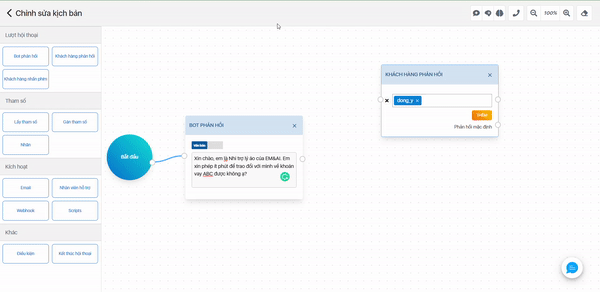

# Các thao tác luồng hội thoại

## Thêm khối

Kéo thả khối từ thư viện (2) vào không gian Canvas (1)

## Xóa khối

### Xóa từng khối

(1) Chọn khối cần xóa

(2) Kích chuột phải

(3) Chọn biểu tượng (x) hoặc bấm nút “delete” để xóa

### Xóa toàn bộ khối:

(1) Chọn nút trên thanh công cụ NLP

(2) Chọn để xác nhận xóa toàn bộ các khối trong luồng hội thoại

## Kết nối

Kết nối là đường nối giữa hai khối với nhau nhằm tạo điều hướng hành động và thứ tự phản hồi trong luồng hội thoại. Cách tạo như sau

(1) Thêm vào các khối cần tạo kết nối

(2) Chọn điểm nối trên khối này và kéo chuột đến điểm nối của khối kia để tạo liên kết giữa 2 khối.

